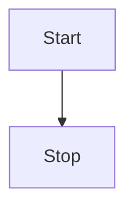

# HCodeView简介
HCodeView可以帮开发者在开发Android程序的时候在页面上快速生成一个验证码，而验证码的数量，颜色，类别均可以让开发者自定义。如果在使用中不定义数量和类别以及颜色，HCodeView默认提供纯4位数字验证码，黑色背景和红色字体

# HCodeView功能
| 函数名 | 功能描述|
|--|--|
|setNumber_count(int count)  |设置验证码数字位数 |
|setLower_count(int count)  |设置验证码小写字母位数 |
|setUpper_count(int count)  |设置验证码大写字母位数 |
|setBackgroundColor(int color)  |设置视图背景颜色 |
|setTextColor(int color)  |设置验证码文字颜色 |
|generateCode(void) |生成验证码|
|getCode(void) |获取验证码 返回值是String|

# 1111


# HCodeView导入并使用
下载HCodeView的jar包，导入到项目工程里的libs文件夹
右键jar包进行装载
## 使用HCodeView
在XMl布局文件中输入HCodeView会自动补全类名，随后设置控件id，长和宽。
在Java代码中进行findViewById即可使用
# 使用例子

```java
public class MainActivity extends AppCompatActivity {

    Button button;
    HCodeView codeView;

    @SuppressLint("MissingInflatedId")
    @Override
    protected void onCreate(Bundle savedInstanceState) {
        super.onCreate(savedInstanceState);
        setContentView(R.layout.activity_main);
        codeView = findViewById(R.id.HCodeView);
        codeView.setNumber_count(1);
        codeView.setLower_count(1);
        codeView.setUpper_count(1);
        codeView.setBackgroundColor(Color.BLUE);
        codeView.setTextColor(Color.WHITE);

        button = findViewById(R.id.button);
        button.setOnClickListener(new View.OnClickListener() {
            @Override
            public void onClick(View view) {
                codeView.generateCode();
                codeView.getCode();
            }
        });


    }
}
```
# Getting Started

### Reference Documentation

For further reference, please consider the following sections:

* [Official Apache Maven documentation](https://maven.apache.org/guides/index.html)
* [Spring Boot Maven Plugin Reference Guide](https://docs.spring.io/spring-boot/3.4.2/maven-plugin)
* [Create an OCI image](https://docs.spring.io/spring-boot/3.4.2/maven-plugin/build-image.html)
* [MyBatis Framework](https://mybatis.org/spring-boot-starter/mybatis-spring-boot-autoconfigure/)
* [Spring Web](https://docs.spring.io/spring-boot/3.4.2/reference/web/servlet.html)

### Guides

The following guides illustrate how to use some features concretely:

* [MyBatis Quick Start](https://github.com/mybatis/spring-boot-starter/wiki/Quick-Start)
* [Accessing data with MySQL](https://spring.io/guides/gs/accessing-data-mysql/)
* [Building a RESTful Web Service](https://spring.io/guides/gs/rest-service/)
* [Serving Web Content with Spring MVC](https://spring.io/guides/gs/serving-web-content/)
* [Building REST services with Spring](https://spring.io/guides/tutorials/rest/)

### Maven Parent overrides

Due to Maven's design, elements are inherited from the parent POM to the project POM.
While most of the inheritance is fine, it also inherits unwanted elements like `<license>` and `<developers>` from the
parent.
To prevent this, the project POM contains empty overrides for these elements.
If you manually switch to a different parent and actually want the inheritance, you need to remove those overrides.

